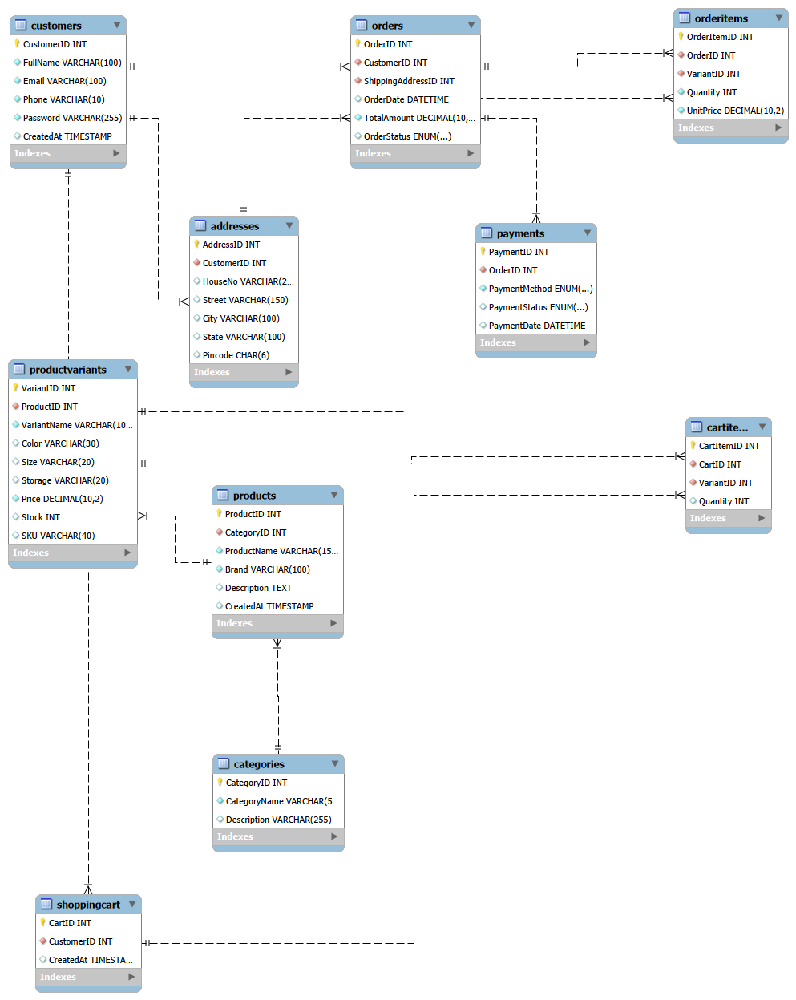

## Task1_Ecommerce_Database
A relational database schema for an e-commerce platform, designed and implemented in MySQL. This project models the core entities of an online store — customers, product catalog, shopping cart, orders, payments, and shipping addresses — with proper normalization, foreign key relationships, and data integrity constraints.

## Overview
This schema supports a typical e-commerce workflow:
Customers register and save one or more shipping addresses
Products are organized into categories, with each product offering multiple variants (color, size, storage, etc.)
Customers add variants to a shopping cart before checking out
Checkout creates an order (linked to a shipping address) with one or more order line items
Each order has exactly one payment record tracking method and status
Repository Structure
## File	Description
Task1_ElevateLabs.sql	Full SQL script — schema (DDL) + data 
Task1 ERR Diagram.mwb	MySQL Workbench source file for the ER diagram
T1.png	Exported image of the ER diagram
README.md	Project documentation (this file)

## Entity-Relationship Diagram

## Schema Design
10 tables, organized around four functional groups:

## 1. Identity & Location
customers — registered users (name, email, phone, password)
addresses — one-to-many shipping addresses per customer

## 2. Catalog
categories — top-level product categories
products — product listings, each belonging to one category
productvariants — sellable SKUs per product (color/size/storage/price/stock)

## 3. Cart
shoppingcart — one active cart per customer
cartitems — variants + quantities held in a cart

## 4. Orders & Payments
orders — a customer's order, linked to a shipping address
orderitems — line items of an order (variant, quantity, unit price at time of purchase)
payments — one payment record per order (method + status)

## Relationships 
customers ──< addresses
customers ──< shoppingcart ──< cartitems >── productvariants
customers ──< orders >── addresses (ShippingAddressID)
orders ──< orderitems >── productvariants
orders ── payments (1:1)
categories ──< products ──< productvariants

──< = one-to-many · >── = many-to-one

## Key Design Decisions
Price history preserved: orderitems.UnitPrice stores the price at the time of purchase, independent of productvariants.Price, which may change later.
Referential safety: deleting a category, customer, or productvariant that has existing orders is RESTRICTed rather than cascaded, so historical order data can't be silently destroyed.
One cart per customer: enforced via a UNIQUE constraint on shoppingcart.CustomerID.
No duplicate cart lines: UNIQUE(CartID, VariantID) on cartitems prevents the same variant being added as two separate rows.
Data validation: CHECK constraints enforce valid email/phone/pincode formats and non-negative prices, stock, and quantities.

## Tech Stack
Database: MySQL 8.x
Modeling tool: MySQL Workbench (.mwb)
